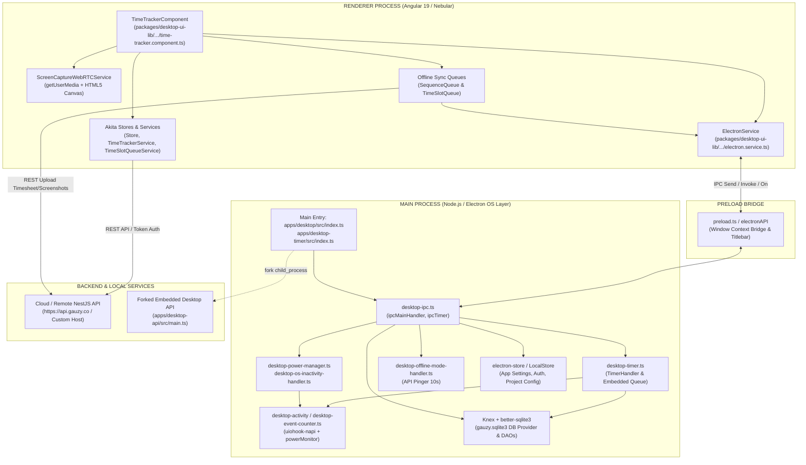

# BÁO CÁO KỸ THUẬT KIẾN TRÚC DESKTOP APPLICATION (GAUZY DESKTOP & DESKTOP TIMER)

---

## 1. Bản đồ Cấu trúc File & Thư mục (Directory Mapping)

Kiến trúc Desktop của Gauzy tuân theo mô hình **Nx Monorepo**, phân tách rành mạch giữa các ứng dụng Electron Runner (`apps/`), giao diện người dùng UI Renderer và các thư viện lõi chuyên trách (`packages/`).

```text
apps/
├── desktop/ # Ứng dụng Desktop chính (Full Gauzy ERP + Time Tracker tích hợp)
├── desktop-timer/ # Ứng dụng Desktop Timer thu nhỏ (Chuyên theo dõi giờ làm & chụp màn hình)
└── desktop-api/ # Backend NestJS thu nhỏ chạy local (Embedded API server)
packages/
├── desktop-core/ # Quản lý Logger, LocalStore (electron-store), Window Management cơ bản
├── desktop-window/ # Quản lý vòng đời cửa sổ BrowserWindow (Timer, Settings, Splash, Notification)
├── desktop-activity/ # Native hooks (uiohook-napi), powerMonitor, tính % chuột/phím & AFK
├── desktop-lib/ # Main process logic: IPC Handlers, Database SQLite (Knex), Đồng bộ Offline, Tray
└── desktop-ui-lib/ # UI Renderer (Angular 19 + Nebular + Akita State), WebRTC Capturer, Sync Queue
```

### Chi tiết vị trí và vai trò từng file cốt lõi

| Phân hệ / Tầng | Đường dẫn file cốt lõi | Vai trò kỹ thuật chi tiết |
|---|---|---|
| Main Process Entry | `index.ts` | Khởi tạo Electron app lifecycle (`app.on('ready')`), mở database SQLite/Knex, khởi tạo Splash Screen, Tray Icon, kích hoạt router deep-link (`gauzy-timer://`), và đăng ký các luồng IPC. |
| Main Process Core Logic | `desktop-ipc.ts`, `desktop-timer.ts` | Định nghĩa toàn bộ `ipcMain.handle` và `ipcMain.on`, quản lý bộ đếm giờ (`TimerHandler`), kích hoạt chụp màn hình định kỳ và hàng đợi xử lý ngầm (`embedded-queue`). |
| Preload Scripts | `preload.ts` | Gắn custom window titlebar (`custom-electron-titlebar`), bảo vệ ngữ cảnh an toàn giữa OS và DOM. |
| Renderer Process (UI Core) | `time-tracker.component.ts` | Component Angular điều khiển giao diện Timer: nhận click Start/Stop, chọn Task/Project, hiển thị thời lượng, quản lý các popup cảnh báo. |
| Renderer Electron Bridge | `electron.service.ts` | Service Angular đóng gói `ipcRenderer`, chuyển đổi các sự kiện IPC sang RxJS Observable (`fromEvent`, `invoke$`). |
| WebRTC Screen Capture | `screen-capture.service.ts` | Chụp màn hình chất lượng cao thông qua `navigator.mediaDevices.getUserMedia` + HTML5 `<canvas>`, hỗ trợ cả giao thức Wayland (Linux). |
| Native Activity & Hooks | `kb-mouse.ts`, `desktop-event-counter.ts` | Lắng nghe sự kiện chuột/phím toàn hệ thống qua `uiohook-napi` và kiểm tra thời gian nhàn rỗi với `powerMonitor.getSystemIdleTime()`. |
| Offline DB & Migrations | `better-sqlite-provider.ts`, `dao` | Lưu trữ bản ghi time logs, intervals, screenshots cục bộ tại file `gauzy.sqlite3` (better-sqlite3 + Knex Query Builder). |
| Offline Sync Queues | `sequence-queue.ts`, `time-slot-queue.ts` | Máy trạng thái (State Pattern) quản lý đồng bộ tuần tự các phiên bấm giờ và ảnh chụp khi có kết nối mạng trở lại. |
| Configuration Files | `project.json`, `tsconfig.electron.json`, `package.json` | Cấu hình build Nx, webpack tùy biến cho Angular, tsconfig cho Main process, cấu hình đóng gói electron-builder đa nền tảng (macOS, Windows, Linux x64/arm64). |

---

## 2. Kiến trúc liên kết & Luồng tương tác giữa các File (Inter-file Architecture)

Hệ thống được thiết kế theo mô hình **Multi-tier Process Architecture**:



---

## 3. Chi tiết Cơ chế Giao tiếp IPC (Inter-Process Communication)

Toàn bộ các kênh giao tiếp IPC được phân định trong `desktop-ipc.ts` và được UI gọi qua `electron.service.ts`.

### 3.1. Các kênh `ipcMain.handle` (Two-Way Async Invocation)

| Channel Name | File định nghĩa | Nhiệm vụ thực thi ở hệ điều hành (OS Layer) |
|---|---|---|
| `START_TIMER` | `desktop-ipc.ts` | Bật bộ theo dõi chuột/phím, cấu hình sleep prevention (`powerMonitor`), tạo record Timer trong local SQLite và khởi chạy interval đếm giờ. |
| `STOP_TIMER` | `desktop-ipc.ts` | Dừng interval đếm giờ, thu thập hoạt động cuối cùng, đánh dấu Timer kết thúc trong SQLite, giải phóng `powerManager`. |
| `COLLECT_ACTIVITIES` | `desktop-ipc.ts` | Trả về thống kê % thao tác bàn phím, chuột, ứng dụng active window và log của ActivityWatch / WakaTime trong khoảng thời gian vừa chạy. |
| `DESKTOP_CAPTURER_GET_SOURCES` | `desktop-ipc.ts` | Gọi `desktopCapturer.getSources({ types: ['screen'] })` lấy danh sách màn hình khả dụng. |
| `GET_SCREEN_SOURCES` | `desktop-ipc.ts` | Lấy danh sách ID và tên hiển thị các màn hình (phục vụ bộ chụp WebRTC). |
| `UPDATE_SYNCED_TIMER` | `desktop-ipc.ts` | Cập nhật cờ `synced: true`, gắn `timelogId` và `timeslotId` từ Backend vào cơ sở dữ liệu SQLite cục bộ. |
| `UPDATE_SYNCED` | `desktop-ipc.ts` | Cập nhật trạng thái đồng bộ của bản ghi Interval (TimeSlot) trong database local. |
| `UPDATE_SYNC_STATE` | `desktop-ipc.ts` | Ghi trạng thái đồng bộ chi tiết (`SYNCING`, `SYNCED`, `FAILED`) vào SQLite để kiểm soát retry. |
| `DELETE_TIME_SLOT` | `desktop-ipc.ts` | Xóa khoảng thời gian làm việc khỏi SQLite local và đồng bộ xoá sang remote server. |
| `IS_OFFLINE` | `apps/desktop/src/index.ts` | Kiểm tra trạng thái mất kết nối mạng hiện tại từ `DesktopOfflineModeHandler`. |
| `CHECK_MACOS_PERMISSIONS` | `desktop-ipc.ts` | Kiểm tra quyền truy cập OS trên macOS (`systemPreferences.getMediaAccessStatus('screen')` & `isTrustedAccessibilityClient`). |
| `RESET_SCREEN_PERMISSION` | `desktop-ipc.ts` | Gọi lệnh CLI `tccutil reset ScreenCapture <bundleId>` trên macOS khi bị lỗi quyền. |
| `GET_AUDIT_LOGS` / `EXPORT_AUDIT_LOGS` | `desktop-ipc.ts` | Truy vấn và xuất nhật ký vận hành ra file log. |

### 3.2. Các kênh `ipcMain.on` (One-Way Messaging)

| Channel Name | Phía gửi | Phía nhận & Nhiệm vụ |
|---|---|---|
| `time_tracker_ready` | Renderer (`TimeTrackerComponent`) | Main process kiểm tra trạng thái user, network, trả về dữ liệu khởi tạo (`timer_tracker_show`) và kích hoạt kiểm tra đồng bộ ngầm. |
| `return_time_slot` | Renderer (`TimeTrackerComponent`) | Main process cập nhật `timeSlotId` cho Timer hiện tại và tiếp tục tạo Timer mới nếu chưa dừng. |
| `create-synced-interval` | Renderer (`TimeTrackerComponent`) | Lưu dữ liệu interval (hoạt động + ảnh) đã đồng bộ thành công vào SQLite. |
| `failed_synced_timeslot` | Renderer (`TimeTrackerComponent`) | Lưu interval chưa gửi được vào SQLite với cờ `synced: false`. |
| `save_screen_shoot` | Renderer (`TimeTrackerComponent`) | Main lưu ảnh chụp ra đĩa tạm và gửi thông báo hiển thị lên cửa sổ `notificationWindow`. |
| `save_temp_img` | Main (`desktop-screenshot.ts`) | Báo cho Renderer biết ảnh chụp lưu tạm ở đâu khi mất mạng. |
| `timer_push` | Main (`desktop-timer.ts`) | Phát tín hiệu mỗi giây (`{ hours, minute, second }`) về Renderer UI để render đồng hồ đếm. |
| `prepare_activities_screenshot` | Main (`desktop-timer.ts`) | Yêu cầu Renderer thực hiện chụp màn hình và đóng gói payload hoạt động. |
| `offline-handler` | Main (`desktop-offline-mode-handler.ts`) | Báo cho toàn bộ UI biết app đã chuyển sang chế độ Offline/Online. |
| `backup-timers-no-synced` | Main (`desktop-ipc.ts`) | Đẩy danh sách các phiên đếm giờ chưa đồng bộ lên Renderer để nạp vào `SequenceQueue`. |

---

## 4. Luồng Dữ liệu Kỹ thuật Chi tiết (Data Flow & Technical Workflows)

### 4.1. Luồng Start / Stop Timer

```text
┌───────────────────────────┐  ┌──────────────────────────┐  ┌───────────────────────┐    ┌─────────────────────────────────┐        ┌───────────────────────┐    ┌────────────────────┐
│ TimeTrackerComponent (UI) │  │ ElectronService (Bridge) │  │ desktop-ipc.ts (Main) │    │ TimerHandler (desktop-timer.ts) │        │ Knex / better-sqlite3 │    │ NestJS Backend API │
└───────────────────────────┘  └──────────────────────────┘  └───────────────────────┘    └─────────────────────────────────┘        └───────────────────────┘    └────────────────────┘
              │                              │                           │                                 │                                     │                           │
              │◄─────────────────────────────────────────────────────────────────────────────Click "Start Timer"─────────────────────────────────────────────────────────────────────────│
              │                              │                           │                                 │                                     │                           │
              │invoke('START_TIMER', projectInfo)                        │                                 │                                     │                           │
              │                              │─────IPC START_TIMER───────►                                 │                                     │                           │
              │                              │                           │──────────startTimer()───────────►                                     │                           │
              │                              │                           │                                 │TimerService.save(new Timer({ synced:false... }))                  │
              │                              │                           │                                 ├────────────────────────────────────►│                           │
              │                              │                           │                                 │ setInterval(1000) -> calculateTimeRecord() ─┐                     │
              │                              │                           │                                 │◄────────────────────────────────────────────┘                     │
              │                              │                           │                                 │                                     │                           │
              │                              ◄─────────────────webContents.send('timer_push', { hour, minute, second })───────────────────│                           │
              │ Render đồng hồ nhảy số (00:00:01...) ─┐                  │                                 │                                     │                           │
              │◄──────────────────────────────────────┘                  │                                 │                                     │                           │
              │                              │                           ◄┈┈┈┈┈┈┈┈┈┈┈┈┈┈┈┈┈┈┈Return timer record┈┈┈┈┈┈┈┈┈┈┈┈┈┈┈┈┈┈┈┈             │                           │
              │                              │                           │                                 │                                     │                           │
              │────────────────────────────────────────────────────HTTP POST /api/timesheet/timer/start (toggleApiStart)────────────────────────────────────────────────────────►│
              │                              │                           │                                 │                                     │                           │
              │◄┈┈┈┈┈┈┈┈┈┈┈┈┈┈┈┈┈┈┈┈┈┈┈┈┈┈┈┈┈┈┈┈┈┈┈┈┈┈┈┈┈┈┈┈┈┈┈┈┈┈┈┈┈┈┈┈┈┈┈┈┈┈┈┈┈┈┈┈┈┈Trả về TimeLog ID┈┈┈┈┈┈┈┈┈┈┈┈┈┈┈┈┈┈┈┈┈┈┈┈┈┈┈┈┈┈┈┈┈┈┈┈┈┈┈┈┈┈┈┈┈┈┈┈┈┈┈┈┈┈┈┈┈┈┈┈┈┈┈┈┈┈┈┈┈┈┈┈┤
              │                              │                           │                                 │                                     │                           │
              │invoke('UPDATE_SYNCED_TIMER', timelogId, synced: true)───►                                 │                                     │                           │
              │                              │                           │Cập nhật timelogId vào SQLite    │                                     │                           │
              │                              │                           ├──────────────────────────────────────────────────────────────────────►│                           │
```

**Mã nguồn then chốt — Khởi tạo Timer trong Main Process:**

```typescript
// Trích đoạn packages/desktop-lib/src/lib/desktop-timer.ts
async startTimer(setupWindow, knex, timeTrackerWindow, timeLog) {
    this._activities = [];
    this._eventCounter.start();      // Bắt đầu đếm sự kiện chuột/phím
    this._activeWindow.start();       // Theo dõi cửa sổ ứng dụng đang mở
    const appSetting = LocalStore.getStore('appSetting');
    appSetting.timerStarted = true;
    LocalStore.updateApplicationSetting(appSetting);
    this.timeStart = moment();
    await this.createTimer(timeLog); // Ghi record vào SQLite local
    await this.collectActivities(setupWindow, knex, timeTrackerWindow);
    if (!appSetting.randomScreenshotTime) {
        await this.startTimerIntervalPeriod(setupWindow, knex, timeTrackerWindow);
    }
}
```

### 4.2. Luồng Chụp Màn Hình Tự Động (Auto Screenshot Capture)

1. **Kích hoạt chu kỳ:** Tại `desktop-timer.ts`, hàm `startTimerIntervalPeriod()` hoặc `randomScreenshotUpdate()` kích hoạt theo cấu hình `updatePeriod` (ví dụ: mỗi 10 phút hoặc random tick).
2. **Thu thập hoạt động:** `TimerHandler.getAllActivities()` tập hợp dữ liệu bàn phím, chuột, active window, rồi gửi event `prepare_activities_screenshot` lên Renderer UI.
3. **Thực hiện chụp màn hình (Capture Execution):**
   * **Trên Windows / macOS:** Renderer sử dụng `desktopCapturer.getSources({ types: ['screen'] })` hoặc Main process dùng thư viện `screenshot-desktop`.
   * **Trên Linux (Wayland):** UI kích hoạt `screen-capture.service.ts`, sử dụng API `navigator.mediaDevices.getUserMedia` đưa stream vào `<video>` ẩn và vẽ ra `<canvas>` để xuất ảnh Base64.
4. **Xử lý nén & Upload:**
   * Ảnh được tạo kèm thumbnail ($320 \times 240\text{ px}$).
   * UI gọi `TimeTrackerService.createTimeSlot()` tạo bản ghi thời gian trên Backend, sau đó gửi ảnh qua HTTP POST tới `/api/timesheet/screenshot`.
   * **Nếu có mạng:** Main process xóa file tạm trên ổ đĩa (`removeScreenshotLocally()`) và gửi `last_capture_local` để preview ảnh góc màn hình.
   * **Nếu mất mạng:** Chuyển ảnh vào `desktop-screenshot.ts:428`, lưu vào thư mục `<userData>/public/temp/` và ghi bản ghi vào SQLite để đồng bộ sau.

```typescript
// Trích đoạn packages/desktop-ui-lib/src/lib/electron/services/electron/screen-capture.service.ts
const stream = await navigator.mediaDevices.getUserMedia({
    audio: false,
    video: {
        mandatory: {
            chromeMediaSource: 'desktop',
            chromeMediaSourceId: source.id,
            maxWidth: width,
            maxHeight: height
        }
    }
});

// Render stream vào canvas để lấy Base64 PNG
ctx.drawImage(video, 0, 0, canvas.width, canvas.height);
const screenshot = canvas.toDataURL('image/png');
```

### 4.3. Luồng Theo dõi Hoạt động & Thời gian Nhàn rỗi (Activity & Idle Tracking)

Gauzy kết hợp 3 lớp giám sát phần cứng và hệ điều hành:

1. **Native Global Hooks (`uiohook-napi`):** Trong `kb-mouse.ts`, thư viện native `uiohook-napi` lắng nghe sự kiện `keydown`, `keyup`, `mousemove`, `click` trên toàn hệ điều hành mà không cần cửa sổ app phải focus.
2. **Bộ đếm tỷ lệ phần trăm (`DesktopEventCounter`):** Trong `desktop-event-counter.ts`, mỗi giây trôi qua nếu có tương tác sẽ cộng biến đếm:

$$\text{keyboardPercentage} = \left\lceil \frac{\text{activeSeconds.keyboard}}{\text{totalIntervalSeconds} / 100} \right\rceil$$

$$\text{mousePercentage} = \left\lceil \frac{\text{activeSeconds.mouse}}{\text{totalIntervalSeconds} / 100} \right\rceil$$

3. **Phát hiện nhàn rỗi (`DesktopOsInactivityHandler` & `powerMonitor`):**
   * Khi `powerMonitor.getSystemIdleTime()` vượt quá ngưỡng cấu hình (`inactivityTimeLimit`, mặc định 10 phút), Main Process kích hoạt event `activity-proof-request`.
   * Cửa sổ Desktop bật popup hỏi: *"Are you still working?"*.
   * **Nếu người dùng bấm Accept:** Hệ thống tiếp tục đếm giờ.
   * **Nếu Timeout hoặc Reject:** Main gọi `desktop-os-inactivity-handler.ts:193`, tự động khấu trừ toàn bộ thời gian nhàn rỗi ra khỏi Timer và SQLite local, đồng thời tạm dừng bấm giờ (`pauseTracking()`).

---

## 5. Quản lý Trạng thái & Đồng bộ Offline (Offline Sync & State Management)

### 5.1. Cơ chế Lưu trữ Cục bộ Đa tầng (Local Storage Layers)

Hệ thống lưu trữ 3 tầng độc lập:
* **`electron-store` (`LocalStore`):** Lưu cấu hình ứng dụng, Tokens xác thực, ID công ty/dự án đang chọn, theme tại file JSON trong `userData`.
* **`better-sqlite3` / `sqlite3` (Knex ORM):** Cơ sở dữ liệu quan hệ cục bộ đặt tại `<userData>/gauzy.sqlite3`, chứa toàn bộ Schema bảng: `timers`, `intervals`, `screenshots`, `activity_watch_events`, `audit_logs`.
* **Akita State Management (Angular UI):** Quản lý trạng thái tức thời ở UI (Task Table Store, Ignition State Store).

### 5.2. Quy trình Đồng bộ Lại Dữ liệu (Re-sync Pipeline)

1. **Phát hiện mạng:** `desktop-offline-mode-handler.ts` thực hiện ping API Server định kỳ mỗi 10 giây.
2. **Kích hoạt Re-sync:** Khi mạng khôi phục, event `'connection-restored'` phát ra $\rightarrow$ Main gửi `backup-timers-no-synced` chứa các sequence chưa sync lên UI.
3. **Xử lý hàng đợi trạng thái (State Pattern):**
   * `sequence-queue.ts` nhận danh sách các phiên bấm giờ offline.
   * Chuyển trạng thái từ `BlockedSequenceState` $\rightarrow$ `InProgressSequenceState`.
   * Với mỗi Timer: Tạo TimeLog mới trên Backend (`addTimeLog` hoặc `toggleApiStart`/`Stop`), lấy về remote `timeLogId`.
   * Nạp các khoảng làm việc con vào `time-slot-queue.ts` để gửi activities và upload ảnh chụp tương ứng qua `uploadImages()`.
   * Gọi IPC `UPDATE_SYNCED_TIMER` cập nhật trạng thái `synced = true` trong file SQLite local.
   * Khi xử lý xong tất cả, chuyển sang `CompletedSequenceState`, mở khoá hàng đợi và thông báo đồng bộ thành công cho người dùng.

---

## 6. Tổng kết Đánh giá Kiến trúc

###  Ưu điểm
* Phân tách rõ ràng giữa Core Native Logic và UI Presentation thông qua Nx Monorepo (`desktop-lib`, `desktop-activity`, `desktop-ui-lib`).
* Khả năng hoạt động Offline hoàn chỉnh nhờ cơ sở dữ liệu nhúng SQLite (`better-sqlite3`) và máy trạng thái đồng bộ độc lập (`SequenceQueue`).
* Xử lý đa nền tảng tốt (hỗ trợ cả macOS Permissions với `tccutil`, Windows display sleep prevention, và Linux Wayland WebRTC screen capturing).

###  Điểm cần lưu ý khi phát triển
* IPC giữa Main và Renderer tương tác hai chiều khá dày đặc; cần cẩn trọng tránh xung đột lock giữa `isQueueThreadTimerLocked` và các chu kỳ chụp ảnh.
* Native modules (`better-sqlite3`, `uiohook-napi`) phụ thuộc vào ABI của Electron, khi nâng cấp phiên bản Electron trong `package.json` cần chạy lại script `postinstall.electron` (`electron-builder install-app-deps`).