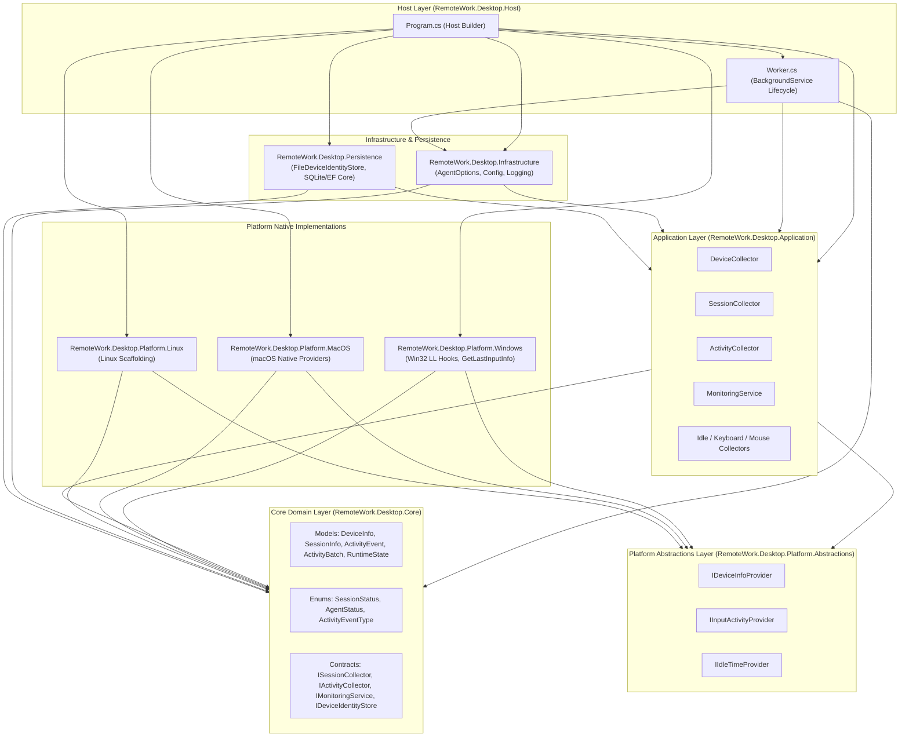

# Target Desktop Architecture

## 1. Executive Summary

RemoteWork Desktop is a cross-platform background tracking and monitoring client designed to operate directly on employee workstations (macOS and Windows initially, Linux scaffolded for future implementation). It functions with zero dependency on Remote Desktop Protocol (RDP) sessions, adheres to strict privacy boundaries, and follows an offline-first data model.

The architecture is structured as a modular Clean Architecture solution using modern C# / .NET (net10.0) Generic Host.

---

## 2. High-Level Architectural Diagram

---

## 3. Layer Separation & Responsibilities

| Project | Type | Responsibilities | Dependencies |
| :--- | :--- | :--- | :--- |
| **`RemoteWork.Desktop.Host`** | Worker Application | Generic Host entry point, dependency injection wireup, OS detection, background runtime orchestration (`Worker`). | All projects |
| **`RemoteWork.Desktop.Core`** | Class Library | Pure domain models, enums, domain interfaces, state transitions. Zero external framework/OS dependencies. | None |
| **`RemoteWork.Desktop.Application`** | Class Library | Use cases, tracking orchestration, batch aggregation, session coordination, activity loops. | `Core`, `Platform.Abstractions` |
| **`RemoteWork.Desktop.Infrastructure`** | Class Library | Configuration binding (`AgentOptions`), logging utilities, external communications abstractions. | `Core`, `Application` |
| **`RemoteWork.Desktop.Persistence`** | Class Library | Device identity storage (`FileDeviceIdentityStore`), local SQLite / EF Core DbContext, repositories. | `Core`, `Application` |
| **`RemoteWork.Desktop.Platform.Abstractions`** | Class Library | OS-neutral contracts for native capabilities (`IDeviceInfoProvider`, `IInputActivityProvider`, `IIdleTimeProvider`). | `Core` |
| **`RemoteWork.Desktop.Platform.Windows`** | Class Library | Windows P/Invoke implementations (Low-Level Keyboard/Mouse hooks, `GetLastInputInfo`, Windows Device Info). | `Platform.Abstractions`, `Core` |
| **`RemoteWork.Desktop.Platform.MacOS`** | Class Library | macOS implementations and scaffold for native system hooks. | `Platform.Abstractions`, `Core` |
| **`RemoteWork.Desktop.Platform.Linux`** | Class Library | Linux platform scaffold. | `Platform.Abstractions`, `Core` |

---

## 4. Key Architectural Patterns

1. **Inversion of Control (IoC):** Domain and Application layers depend solely on abstractions (`IIdleTimeProvider`, `IInputActivityProvider`, `IDeviceInfoProvider`, `IDeviceIdentityStore`). Native OS implementations are plugged in dynamically at Host startup based on `RuntimeInformation.IsOSPlatform`.
2. **Offline-First Strategy:** Local data is stored locally in persistence stores (file storage, SQLite) and synchronized asynchronously with the FastAPI backend without blocking ongoing collection.
3. **Strict Privacy Boundaries:** Only event aggregates and counts are collected. No keystroke logging, no raw clipboard contents, no screen streaming.
