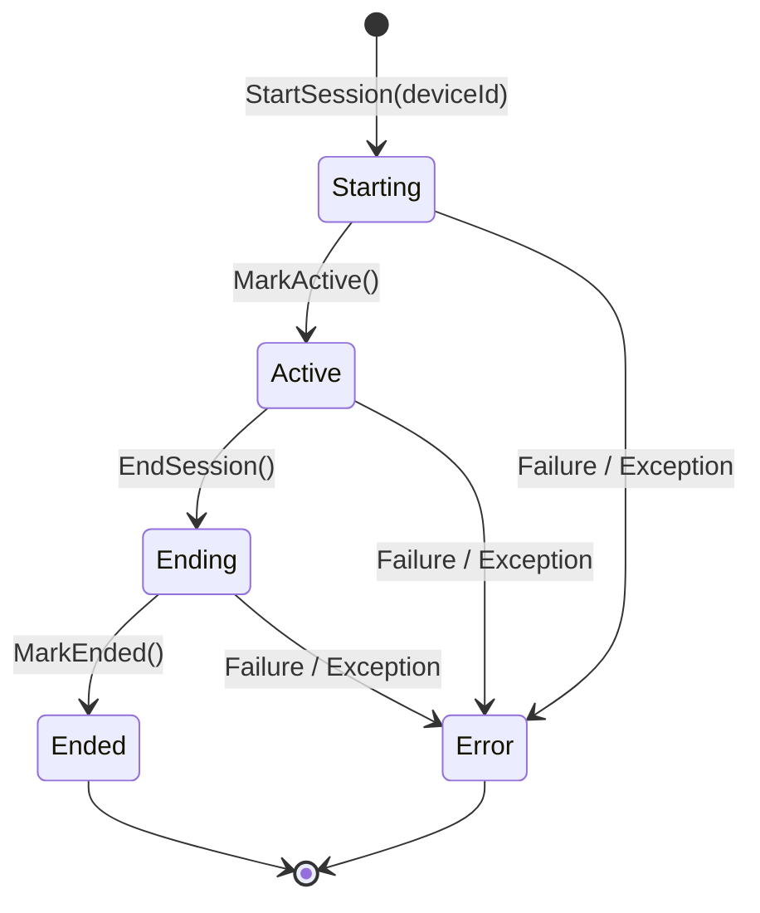

# Phase 04: Session Engine

## 1. Executive Summary

Phase 04 establishes a cross-platform, OS-independent Session Engine for tracking employee working periods. The Session Engine manages domain/application state, enforces valid session state machine transitions, guarantees unique UTC-timestamped session tracking periods bound to a stable device identity (`DeviceId`), and provides cancellation-safe lifecycle orchestration for clean application shutdown.

---

## 2. State Machine & Lifecycle Flow

### Session State Diagram



### Lifecycle Flow

```
Application Starts Tracking
           |
           v
  SessionEngine.StartSession(deviceId)
           |
           +---> Validate DeviceId (non-null/whitespace)
           +---> Ensure no active session exists
           +---> Generate new SessionId (GUID)
           +---> Record StartedAt timestamp (UTC)
           +---> Transition state: Starting -> Active
           v
  Tracking Continues (Activities tagged with SessionId & DeviceId)
           |
           v
Application Stops Tracking / Shutdown Requested
           |
           v
  SessionEngine.EndSession()
           |
           +---> Validate active session exists
           +---> Transition state: Active -> Ending
           +---> Transition state: Ending -> Ended
           +---> Record EndedAt timestamp (UTC)
           +---> Calculate Duration (EndedAt - StartedAt)
           +---> Clear current active session pointer
```

---

## 3. Relationship Between Device and Session

```
+----------------------------------------+
|                Device                  |
|  (Persistent Identity: DeviceId)       |
+----------------------------------------+
                   | 1
                   |
                   | N
+----------------------------------------+
|               Sessions                 |
|  Session 1: SessionId_A (Started/Ended)|
|  Session 2: SessionId_B (Started/Ended)|
|  Session N: SessionId_N (Active)       |
+----------------------------------------+
```

1. **Device Identity (`DeviceId`)**:
   - Persistent GUID generated once per client installation (managed by `IDeviceIdentityStore`).
   - Remains stable across application restarts, OS reboots, and session boundaries.
2. **Session (`SessionId`)**:
   - Ephemeral tracking period created each time application tracking starts.
   - Assigned a fresh, unique GUID (`SessionId`) upon initialization.
   - Always associated with exactly one stable `DeviceId`.
3. **Cardinality**:
   - A single `Device` accumulates multiple `Sessions` over time ($1 : N$).
   - A `Session` cannot be instantiated without a valid `DeviceId`.

---

## 4. Shutdown Behavior & Cancellation Safety

- **Thread-Safe State Synchronization**: `SessionEngine` guards all state queries (`GetCurrentSession`), initialization (`StartSession`), and termination (`EndSession`) using an internal synchronization lock (`_syncLock`).
- **Cancellation Teardown**: When host shutdown is triggered (e.g. via `CancellationToken` or SIGTERM/Ctrl+C), `Worker.ExecuteAsync` executes its `finally` block and calls `_sessionCollector.EndSession()`.
- **Idempotent & Safe Double-Calling**: If `EndSession()` is invoked multiple times or during process exit when no active session exists, it logs gracefully and returns cleanly without raising unhandled exceptions.

---

## 5. Why Session Logic is OS-Independent

1. **Domain Isolation**: `Session`, `SessionInfo`, `SessionStatus`, and `ISessionEngine` reside purely in `RemoteWork.Desktop.Core` and `RemoteWork.Desktop.Application`.
2. **No Platform APIs**: The Session Engine makes zero calls to Windows APIs, macOS Cocoa/CoreGraphics APIs, or Linux system calls.
3. **No Infrastructure Leakage**: The Session Engine does not access SQLite databases or HTTP network services directly.
4. **Universal Reuse**: The exact same Session Engine runs identically on macOS, Windows, and Linux without platform conditional branching (`#if WINDOWS`).

---

## 6. Current Limitations

- **In-Memory Lifecycle Only**: Per Phase 04 scope ("No persistence added"), sessions are tracked in application memory. Local SQLite persistence for offline recovery will be integrated in a subsequent persistence phase.
- **No Direct Network Egress**: Per Phase 04 scope ("No network added"), session lifecycle events are not published over HTTP.
- **Minimal State Machine**: Supports `Starting`, `Active`, `Ending`, `Ended`, and `Error` states. Pause/Resume and Disconnect states are intentionally omitted in this phase.

---

## 7. Future Lock, Sleep, and Disconnect Design

Future phases will introduce OS power and screen events (screen lock, system sleep/wake, network disconnect). The architecture will handle these events seamlessly without altering the core Session Engine:

```
[ Native OS Listener ] ---> (Screen Lock / Sleep / Disconnect)
                                  |
                                  v
                    [ Session OS Adapter / Event Handlers ]
                                  |
                                  +---> Trigger PauseSession() or EndSession()
                                  +---> Resume/Start new Session on unlock/wake
```

- **Screen Lock / Idle Timeout**: Will trigger a paused state or create sub-session activity batches.
- **System Sleep / Hibernation**: Will automatically call `EndSession()` on sleep notification, and initiate a fresh `StartSession()` upon system wake.
- **Network Disconnect**: Will be handled by the upcoming offline queue without interrupting active domain tracking.

---

## 8. Verification & Definition of Done

- **Build**: `dotnet build RemoteWork.Desktop.sln` succeeded with 0 warnings and 0 errors.
- **Unit Tests**: All 71 unit tests passed (`dotnet test RemoteWork.Desktop.sln`).
- **Integration Tests**: All 9 integration tests passed.
- **DoD Checklist**:
  - [x] Session engine works
  - [x] Unit tests pass
  - [x] No persistence added
  - [x] No network added
  - [x] Documentation complete (`docs/phases/phase-04-session-engine.md`)
  - [x] Commit created
