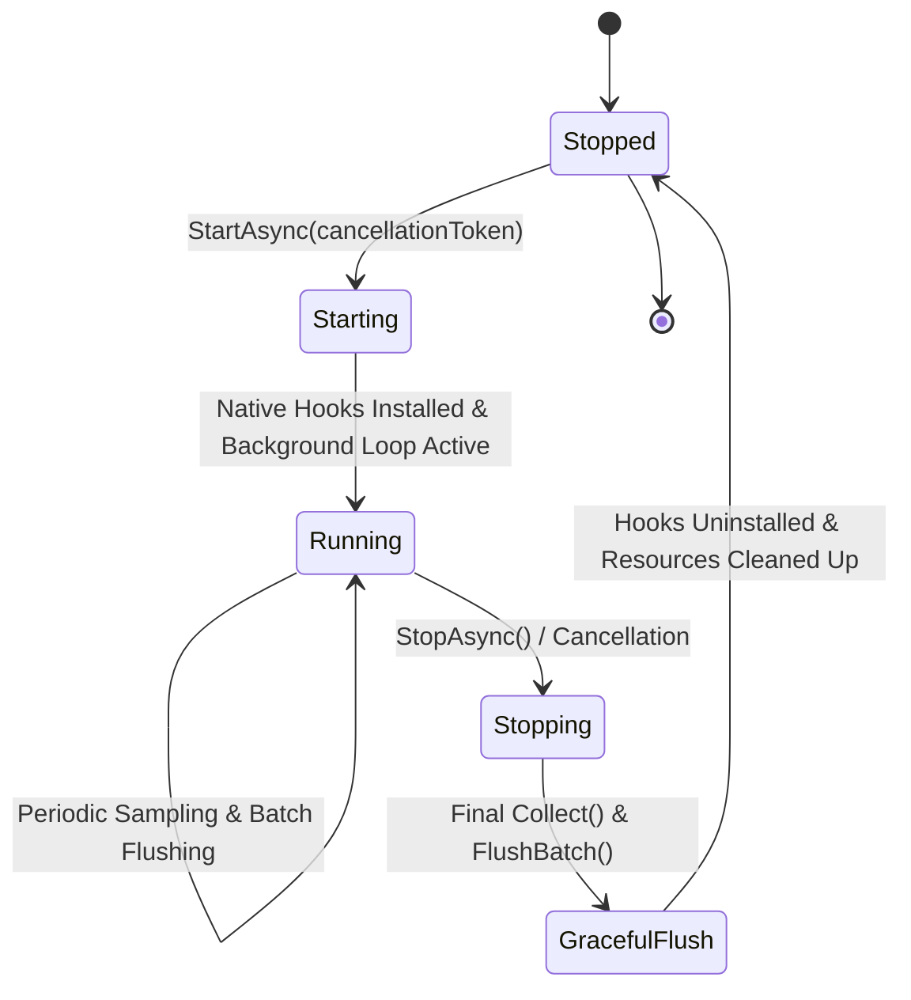

# Phase 06: Activity Aggregation and Monitoring Runtime

## 1. Executive Summary

Phase 06 establishes the **Activity Aggregation and Monitoring Runtime** for the RemoteWork Desktop Agent. It turns low-level hardware input interactions and idle telemetry into structured, timestamped [`ActivityBatch`](file:///Users/caotiendattx/Developer/remote-gent/src/RemoteWork.Desktop.Core/Models/Activity/ActivityBatch.cs) records bound to a stable [`DeviceId`](file:///Users/caotiendattx/Developer/remote-gent/src/RemoteWork.Desktop.Core/Models/Device.cs) and active [`SessionId`](file:///Users/caotiendattx/Developer/remote-gent/src/RemoteWork.Desktop.Core/Models/Session.cs).

Per the architectural boundaries of Phase 06:
- **No Database**: SQLite persistence is decoupled and will be introduced in subsequent phases.
- **No Backend**: Remote HTTP egress is not implemented in this phase.
- **Full Error Isolation**: Individual collector failures (keyboard, mouse, or idle) are caught, logged, and isolated without crashing the tracking runtime.
- **Strict Duration Balancing**: `ActiveDuration + IdleDuration` is mathematically reconciled to approximate `EndedAt - StartedAt` within sampling resolution.
- **Graceful Lifecycle**: Full cancellation token support, clean shutdown with final batch flush, and complete decoupling of the Host from platform-specific input mechanisms.

---

## 2. Pipeline & Data Flow

The tracking pipeline strictly separates the responsibilities across distinct runtime components:

```
┌────────────────────────────────────────────────────────┐
│                   OS Input Providers                   │
│   (MacOsInputActivityProvider, WindowsInputActivity)   │
└───────────────────────────┬────────────────────────────┘
                            │ Raw input counts (atomic reset)
                            ▼
┌────────────────────────────────────────────────────────┐
│                   Activity Collector                   │
│  (Collects counts, samples idle state, isolates errs)  │
└───────────────────────────┬────────────────────────────┘
                            │ Periodic samples (default: 10s)
                            ▼
┌────────────────────────────────────────────────────────┐
│                  Activity Accumulator                  │
│  (Accumulates counts & active/idle duration intervals) │
└───────────────────────────┬────────────────────────────┘
                            │ FlushBatch() (default: 60s / shutdown)
                            ▼
┌────────────────────────────────────────────────────────┐
│                     ActivityBatch                      │
│ (Structured, immutable telemetry block for Session/Dev)│
└───────────────────────────┬────────────────────────────┘
                            │ OnBatchGenerated / logger
                            ▼
┌────────────────────────────────────────────────────────┐
│               Runtime Monitoring Service               │
│ (Coordinates lifecycle, session check, background loop)│
└────────────────────────────────────────────────────────┘
```

---

## 3. Sampling vs. Aggregation

RemoteWork enforces a clear architectural distinction between **Sampling** and **Aggregation**:

| Aspect | Sampling (`Collect()`) | Aggregation (`FlushBatch()`) |
|---|---|---|
| **Primary Component** | [`ActivityCollector`](file:///Users/caotiendattx/Developer/remote-gent/src/RemoteWork.Desktop.Application/Collectors/ActivityCollector.cs) | [`ActivityAccumulator`](file:///Users/caotiendattx/Developer/remote-gent/src/RemoteWork.Desktop.Core/Models/Activity/ActivityAccumulator.cs) |
| **Typical Cadence** | High-frequency (Default: 10 seconds) | Low-frequency (Default: 60 seconds) |
| **Purpose** | Read instantaneous hardware counters; detect active/idle state transitions; emit in-memory domain events. | Group sampled intervals into a structured, bounded data record for local persistence and server dispatch. |
| **State Emission** | Emits `ActivityStateChanged` **only** when state transitions between Active and Idle (no redundant active spam). | Produces an immutable `ActivityBatch` entity. |
| **Reset Scope** | Clears native hook hardware counters back to 0. | Resets accumulated totals and duration clocks back to 0. |
| **Configurability** | `TrackingOptions.ActivitySamplingIntervalSeconds` | `TrackingOptions.ActivityBatchIntervalSeconds` |

> [!NOTE]
> Intervals are fully configurable through `IOptions<TrackingOptions>` or `appsettings.json` and are not hard-coded business rules.

---

## 4. Structured Activity Batch Model

Every [`ActivityBatch`](file:///Users/caotiendattx/Developer/remote-gent/src/RemoteWork.Desktop.Core/Models/Activity/ActivityBatch.cs) encapsulates:
- `BatchId`: Globally unique GUID identifying the aggregation block.
- `DeviceId`: Persistent hardware device identity.
- `SessionId`: Unique identifier of the current active working session.
- `StartedAt`: UTC timestamp marking the beginning of the aggregation window.
- `EndedAt`: UTC timestamp marking the end of the aggregation window.
- `KeyboardCount`: Total key-down interactions observed during the batch.
- `MouseCount`: Total meaningful mouse interactions (clicks, scroll wheel) during the batch.
- `ActiveDuration`: Total wall-clock time the user spent in the `Active` state.
- `IdleDuration`: Total wall-clock time the user spent in the `Idle` state.
- `HasSuspiciousMouseActivity`: Bot detection flag.

### Duration Guarantee

```
Batch Duration = EndedAt - StartedAt
ActiveDuration + IdleDuration ≈ Batch Duration (± sampling resolution)
```

In [`ActivityCollector.FlushBatch()`](file:///Users/caotiendattx/Developer/remote-gent/src/RemoteWork.Desktop.Application/Collectors/ActivityCollector.cs), any elapsed time between the most recent sample tick (`_lastTimestamp`) and the batch flush timestamp (`now`) is attributed to the current activity state before generating the batch. This guarantees that `ActiveDuration + IdleDuration` accounts for the full duration of the batch without missing tail intervals.

---

## 5. Monitoring Runtime & Lifecycle

[`MonitoringService`](file:///Users/caotiendattx/Developer/remote-gent/src/RemoteWork.Desktop.Application/Monitoring/MonitoringService.cs) coordinates the background runtime:

### Lifecycle States



1. **Start**:
   - Explicitly starts native input providers (`IInputActivityProvider.Start()`).
   - Links the cancellation token and launches the periodic sampling loop.
   - Idempotent: repeated calls to `StartAsync` do nothing.
2. **Session Guarding**:
   - Each timer tick inspects `ISessionCollector.GetCurrentSession()`.
   - If no session is active (e.g. paused or not yet initialized), sampling is skipped and no empty batches are produced.
3. **Graceful Shutdown**:
   - When `StopAsync()` is requested (e.g. process termination, SIGTERM, Worker cancellation):
     - Background timer loop is canceled.
     - Final `Collect()` and `FlushBatch()` run to capture any remaining uncommitted time and counts.
     - Triggers `OnBatchGenerated` for all subscribers.
     - Native input providers are explicitly stopped (`IInputActivityProvider.Stop()`).
4. **Decoupled Host**:
   - The host [`Worker`](file:///Users/caotiendattx/Developer/remote-gent/src/RemoteWork.Desktop.Host/Worker.cs) only references `IMonitoringService.StartAsync()` and `IMonitoringService.StopAsync()`.
   - The Host has zero knowledge of hooks, counters, or platform APIs.

---

## 6. Error Isolation Architecture

To prevent a transient or platform-specific failure from crashing the entire tracking runtime:

```
                  ┌────────────────────────────────────────┐
                  │       ActivityCollector.Collect()      │
                  └───────────────────┬────────────────────┘
                                      │
        ┌─────────────────────────────┼─────────────────────────────┐
        ▼                             ▼                             ▼
┌──────────────┐              ┌──────────────┐              ┌──────────────┐
│  Idle Check  │              │ Keyboard Hook│              │  Mouse Hook  │
│  (Isolated)  │              │  (Isolated)  │              │  (Isolated)  │
└───────┬──────┘              └───────┬──────┘              └───────┬──────┘
        │ Exception                   │ Exception                   │ Exception
        ▼                             ▼                             ▼
  Log Warning                   Log Warning                   Log Warning
  Fallback: Active              Fallback: 0                   Fallback: 0
```

1. **Idle Provider Failure**:
   - If `IIdleActivityCollector.IsUserActive()` throws, the exception is caught and logged.
   - Fallback safely defaults to `true` (`Active`) so employees are not wrongly penalized as idle due to sensor errors.
2. **Keyboard Collector Failure**:
   - If `IKeyboardActivityCollector.Collect()` throws, the exception is logged.
   - Keyboard count defaults to 0; mouse collection continues normally.
3. **Mouse Collector Failure**:
   - If `IMouseActivityCollector.Collect()` throws, the exception is logged.
   - Mouse count defaults to 0; keyboard collection continues normally.
4. **Periodic Tick Isolation**:
   - In `MonitoringService.RunAsync`, any unexpected tick exception is caught and logged without aborting the background loop.

---

## 7. Timing Decisions & Performance Impact

- **Sampling Cadence (10s Default)**:
  - Balances low CPU overhead (< 0.1%) with prompt active/idle state transition detection.
  - Queries OS idle timers (`IOKit` / `GetLastInputInfo`) which execute in microseconds without spawning subprocesses.
- **Batch Interval (60s Default)**:
  - Aggregates activity into clean 1-minute blocks.
  - Reduces downstream persistence/sync overhead by orders of magnitude compared to sending per-second events.
- **Thread Safety**:
  - Provider hooks run on dedicated threads. Counter reads and resets use atomic/locked primitives to guarantee zero torn reads.

---

## 8. Verification & Test Coverage

### Test Suites Executed
```bash
dotnet test RemoteWork.Desktop.sln
```

- **RemoteWork.Desktop.UnitTests**: **86 passed** (0 failed, 0 skipped).
  - `BatchDuration_SumOfActiveAndIdleDuration_ApproximatelyEqualsBatchDuration`: Validates `ActiveDuration + IdleDuration ≈ EndedAt - StartedAt`.
  - `BatchBoundaries_MaintainSequentialTimestamps`: Validates contiguous chronological boundaries between successive batches.
  - `Batch_IsAssociatedWithCurrentSessionAndDeviceId`: Validates session and device binding.
  - `ActivityAggregation_AggregatesCountsAcrossSamples_AndFlushBatchResets`: Validates multi-sample accumulation and counter clearing.
  - `Collect_WhenKeyboardCollectorFails_IsolatesErrorAndCollectsMouse`: Validates keyboard error isolation.
  - `Collect_WhenMouseCollectorFails_IsolatesErrorAndCollectsKeyboard`: Validates mouse error isolation.
  - `Collect_WhenIdleCollectorFails_IsolatesErrorAndCollectsInput`: Validates idle error isolation.
  - `Lifecycle_StartsAndStopsInputProviderCleanly`: Validates `MonitoringService` start/stop idempotency.
  - `GracefulShutdown_FlushesFinalActivityBatch_WhenSessionIsActive`: Validates shutdown batch flushing.
  - `Cancellation_TerminatesMonitoringTaskCleanly`: Validates cancellation token handling.
  - `ErrorIsolation_CollectorFailureDoesNotCrashRuntime`: Validates runtime survival during tick failures.
- **RemoteWork.Desktop.IntegrationTests**: **12 passed** (0 failed, 0 skipped).
  - Verified platform providers on host OS (macOS) and fallback contracts on Windows/Linux.
- **Total Tests**: **98 passed (100% green, 0 warnings)**.

---

## 9. Known Limitations & Intentionally Unimplemented Items

- **No Local Persistence**: Batches generated by the runtime are logged and emitted via in-memory events (`OnBatchGenerated`). Local SQLite storage will be added in Phase 07.
- **No Remote Egress**: No HTTP sync queue or API client is attached to `OnBatchGenerated` yet.
- **Single Active Session Assumption**: The runtime assumes at most one active session per client instance at any given point in time.

---

## 10. Definition of Done Checklist

- [x] Runtime starts (`MonitoringService.StartAsync` installs hooks, starts timer)
- [x] Runtime stops cleanly (`StopAsync` terminates background loop, flushes final batch, uninstalls hooks)
- [x] Activity batches are generated (`ActivityBatch` produced at intervals and on shutdown)
- [x] `DeviceId` and `SessionId` are correct (verified via unit and integration tests)
- [x] Tests pass (98/98 unit & integration tests passing with 0 warnings)
- [x] Docs complete (`docs/phases/phase-06-activity-monitoring-runtime.md`)
- [x] Commit created
